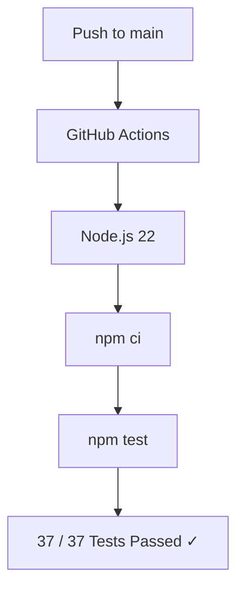
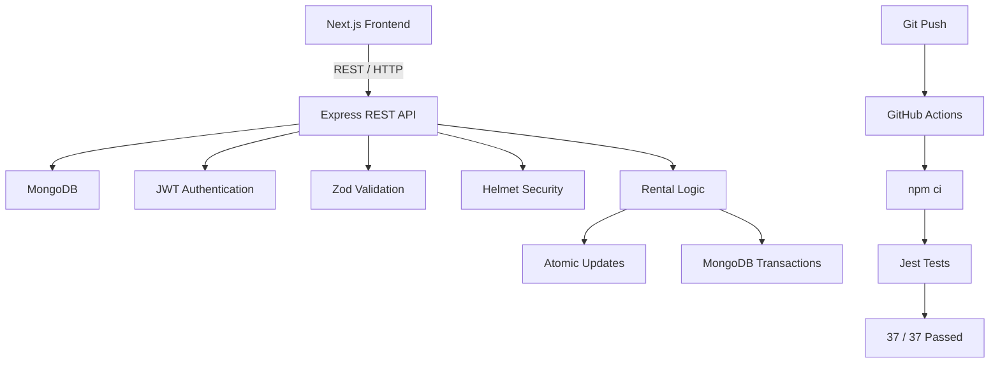

## Tool Sharing:
A full-stack peer-to-peer tool rental platform where users can list tools, rent tools from other users, and manage their rental lifecycle.

Built with Next.js, Node.js, Express, and MongoDB, with JWT authentication, transactional rental operations, concurrency-safe reservations, and automated integration testing.

## Live Demo:
- Frontend: https://toolsharing.vercel.app
- Backend: https://tool-sharing.onrender.com

## Screenshots:
### Landing Page

### Browse Tools

### Add Tool

### My Rentals

## Features:
- Peer-to-peer marketplace — Users can list their own tools and rent tools from other users.
- Secure authentication — JWT-based authentication with protected API routes.
- Rental lifecycle management — Start and end rentals with automatic cost calculation.
- Concurrency-safe rentals — Atomic database updates prevent multiple users from renting the same tool simultaneously.
- Transactional consistency — MongoDB transactions keep tool availability and rental records synchronized.
- Input validation & security — Zod validation and Helmet security headers.
- Pagination & filtering — Efficient browsing of available tools.
- Persistent authentication — Users remain authenticated across sessions.
- Soft deletion — Deleted tools are preserved for historical rental integrity.
- Automated testing — 37 integration tests covering authentication, tools, rentals, authorization, validation, and concurrency scenarios.
- Continuous Integration — GitHub Actions automatically runs the test suite on every push to main.
  
## Testing & CI

The backend includes 37 integration tests covering:

- User registration and authentication
- Protected routes and authorization
- Tool creation and management
- Rental lifecycle
- Invalid input and IDs
- Rental ownership rules
- Concurrent rental attempts
- Pagination and filtering

Tests are automatically executed through GitHub Actions whenever changes are pushed to main.

Test Suites: 4 passed, 4 total
Tests:       37 passed, 37 total

### CI Pipeline

## Tech Stack:

|Sr.No | Layer | Technologies |
|----- | ----- | ------------ |
|1 |Frontend| Next.js , React , Tailwind CSS ,Axios|
|2 |Backend | Node.js, Express.js|          
|3 |Database|MongoDB, Mongoose |
|4 |Authentication|	JWT |
|5 |Validation|	Zod|
|6 |Security|Helmet|
|7 |Testing|Jest, Supertest|
|8 |CI/CD|GitHub Actions|
|9 |Deployment|Vercel, Render|

## Architecture:

## Engineering Highlights:

- Concurrency-safe rental acquisition: Rental availability is checked and updated atomically using a conditional database update. This prevents two concurrent requests from successfully renting the same tool.

- Transactional rental lifecycle: Starting and ending a rental use MongoDB transactions to keep the Tool and Rental documents consistent.

- Historical data integrity: Tools use soft deletion so rental history remains associated with the original tool records.

## Documentation :
- [Backend Documentation- API endpoints, database behavior, rental implementation, and local backend setup.](./server/README.md)
- [Frontend Documentation — Pages, frontend architecture, features, and local setup.](./client/README.md)
