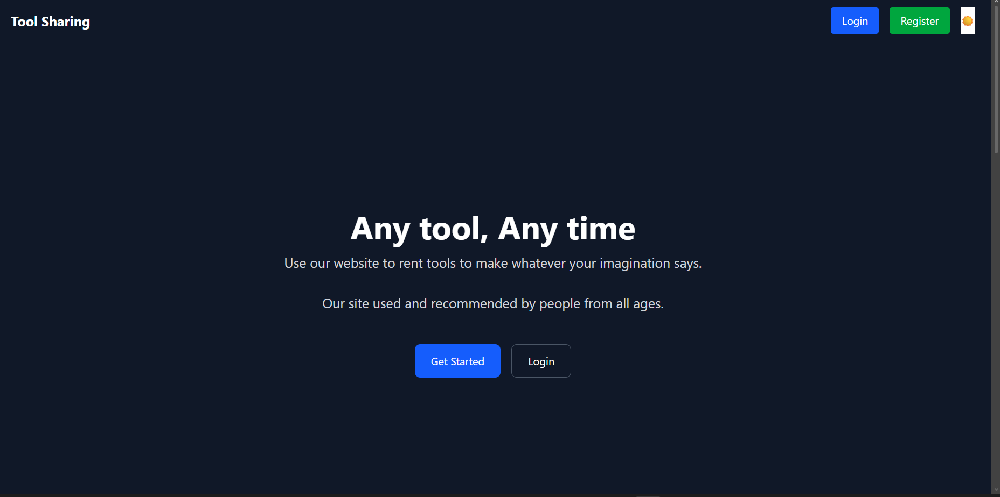
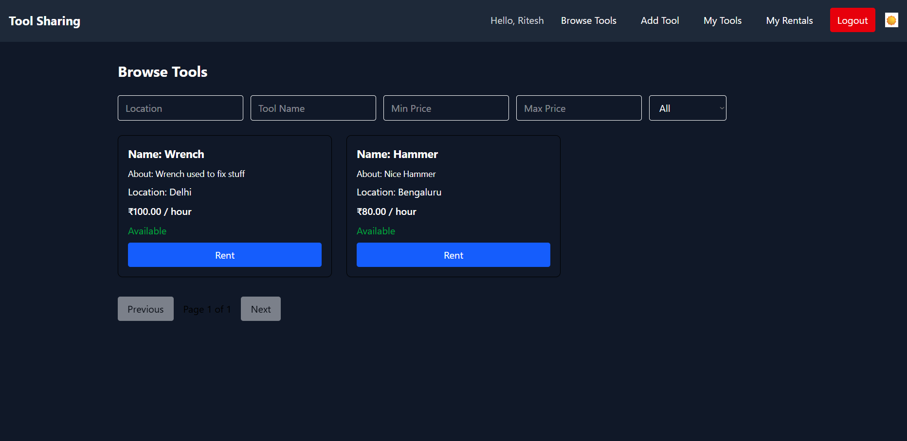
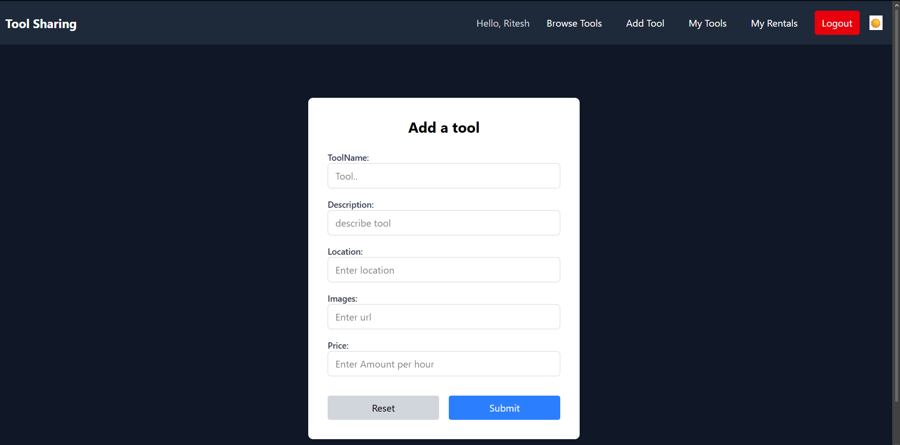
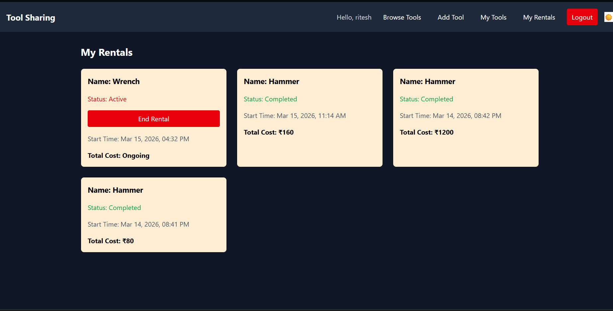

## Tool Sharing:
A peer-to-peer tool rental platform where users can list their tools for rent or borrow tools from others.

## Live Demo:
- Frontend: https://toolsharing.vercel.app
- Backend: https://tool-sharing.onrender.com

## Screenshots:
### Landing Page


### Browse Tools


### Add Tool


### My Rentals


## Features:
- User authentication using JWT
- Tool listing marketplace
- Rental lifecycle management
- Pagination and filtering for browsing tools
- Persistent login
- Dark mode UI
- Protected routes
- Concurrency-safe rental system
  

## Tech Stack:
### 1) Frontend
    - Next.js
    - React
    - Tailwind CSS
    - Axios
      
### 2) Backend
    - Node.js
    - Express.js
    - MongoDB
    - Mongoose
    
 ### 3) Security
    - JWT authentication
    - Helmet
    - Zod validation

## Architecture:
```
Next.js Frontend
        ↓
Express REST API
        ↓
MongoDB Database
```
Docs:
- [Backend README](./server/README.md)
- [Frontend README](./client/README.md)
